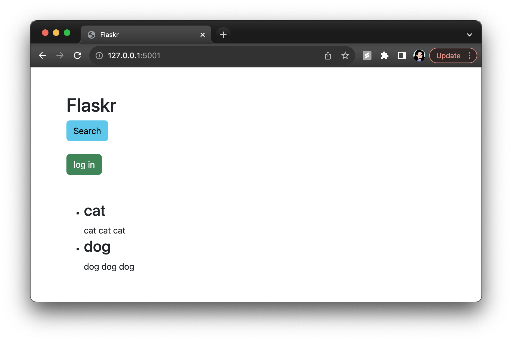
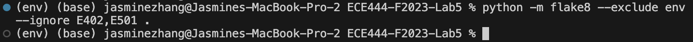
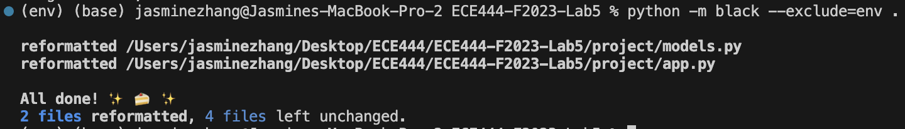

# ECE444-F2023-Lab5

Referencing code from https://github.com/mjhea0/flaskr-tdd

### Sections completed:
1. First Test
2. Database Setup
3. Templates and Views
4. Add Some Style
5. JavaScript
6. Bootstrap
7. SQLAlchemy
8. Search Page
9. Login Required
10. Linting and Code Formatting

### Screenshot of Final Website:


### Unit Test Added:
1. https://github.com/ECE444-2023Fall/project-1-web-application-design-group25-pixelpals/blob/b4a4c376d9244cb728b725713566aeb16fc56012/tests/test_app.py#L42
2. https://github.com/ECE444-2023Fall/project-1-web-application-design-group25-pixelpals/blob/b4a4c376d9244cb728b725713566aeb16fc56012/tests/test_app.py#L57
```
def test_add_event_post(client):            # Jasmine Zhang
    # test adding event (POST request)
    data = {
        'event_name': 'Test Event',
        'date': '01-10-2023',
        'start_time': '10:00 AM',
        'end_time': '12:00 PM',
        'location': 'Test Location',
        'description': 'Test Description',
        'rsvp_link': 'https://google.com',
        'organizer_id': 1
    }
    rv = client.post('/add_event/', data=data)
    assert b"Event created successfully" in rv.data

def test_add_event_post_invalid(client):    # Jasmine Zhang
    # test adding event with invalid data (POST request)
    data = {
        'event_name': '',  # empty name
        'date': '01-10-2023',
        'start_time': '10:00 AM',
        'end_time': '12:00 PM',
        'location': 'Test Location',
        'description': 'Test Description',
        'rsvp_link': 'https://google.com',
        'organizer_id': 1
    }
    rv = client.post('/add_event/', data=data)
    assert b"Error creating event" in rv.data

    data = {
        'event_name': 'Test Event',
        'date': '01-10-2023',
        'start_time': '10:00 AM',
        'end_time': '12:00 PM',
        'location': 'Test Location',
        'description': 'Test Description',
        'rsvp_link': 'invalid-link',  # invalid link
        'organizer_id': 1
    }
    rv = client.post('/add_event/', data=data)
    assert b"Error creating event" in rv.data
```

### Linting and Code Formatting Completed:



### What are the pros and cons of TDD?
The pros of TDD include:
- Early detection of bugs: having tests writen before/around the same time as the code makes it easier to catch bugs early on. This reduces technical debt as the longer a bug goes undetected, the more time and resources it could take to fix later.
- Regression testing: since all the tests are run at once (kind of like e2e) after code changes, you can also make sure that previously working functionality remains intact. This is especially helpful as an application grows in size/features.
- General improvement of code quality: TDD faciliates clearer and more maintainable code that is well-structured and modular (as this helps with tests).

The cons of TDD include:
- Initial overhead: writing tests for code slows down initial development and can be tedious.
- Maintaining and adding tests: requires a lot of time as well, which can slow down general development.
- Required skills in test development: a gap in test coverage can lead to a false sense of security about the application and lead to critical issues being missed.